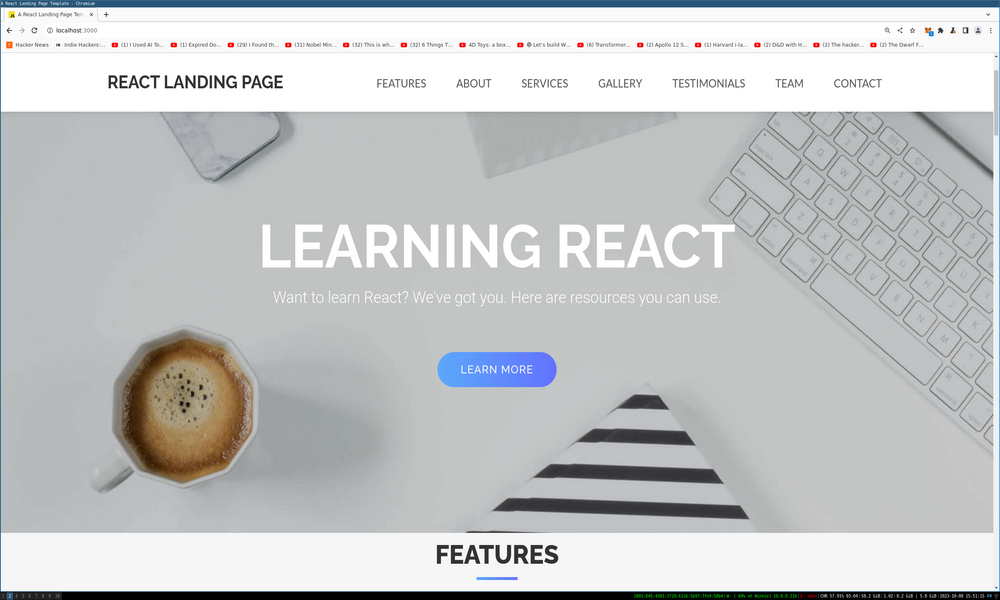

## React JS Landing Page: Learning React

This is a ReactJS based landing page template with a one page view, based on a [fork](https://github.com/issaafalkattan/React-Landing-Page-Template).

Live version here:

[http://react-landing-page-learn-react.s3-website-us-east-1.amazonaws.com/](http://react-landing-page-learn-react.s3-website-us-east-1.amazonaws.com/)

## Description

I'm creating this to show a real working example of a React website that can be created and deployed easily. 

I've changed the data.json text and some of the component text, added images of prominent React folk, and deployed my version to S3.

It has no new code functionality, but that could be added upon request.

You can customize the template for yourself by adding content to src/data/data.json and images to public/img/.

## Run The App

First, git clone this app.

Then, run

`npm init`

And

`npm start`

## Credit

This app was forked from Issaaf Kattan's GitHub repo.

https://github.com/issaafalkattan/React-Landing-Page-Template

If you use it, consider <a href="https://www.buymeacoffee.com/issaaf">buying her a coffee</a>.

